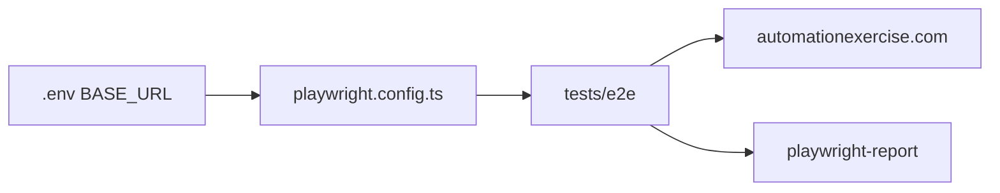

# Demo Website Automation

Playwright E2E test suite with TypeScript and Page Object Model (POM) for [Automation Exercise](https://automationexercise.com).

Repository: [github.com/TestOpsHub/Demo-website-automation](https://github.com/TestOpsHub/Demo-website-automation)

## Prerequisites

- [Node.js](https://nodejs.org/) (LTS recommended)
- npm

## Getting started

```bash
git clone https://github.com/TestOpsHub/Demo-website-automation.git
cd Demo-website-automation
npm install
npx playwright install
```

## Environment variables

Create a `.env` file in the project root (this file is gitignored):

```
BASE_URL=https://automationexercise.com
```

[playwright.config.ts](playwright.config.ts) loads environment variables via `dotenv`. If `BASE_URL` is not set, it defaults to `https://automationexercise.com/`.

## Running tests

| Command | Description |
|---------|-------------|
| `npm run test:e2e` | Run E2E tests headless |
| `npm run test:e2e:headed` | Run E2E tests with browser UI |
| `npx playwright test` | Run all tests under `tests/` |
| `npx playwright show-report` | Open HTML report after a run |

## Project structure

Tests and page objects are organized using the Page Object Model pattern:

```
Demo-website-automation/
├── tests/
│   └── e2e/           # Test specs
├── pages/             # Page Object classes (recommended)
├── playwright.config.ts
├── .env               # Local env (not committed)
└── package.json
```

## Configuration

Key settings from [playwright.config.ts](playwright.config.ts):

- **Browsers:** Chromium, Firefox, WebKit (desktop)
- **Reporter:** HTML (`playwright-report/`)
- **Trace:** captured on first retry
- **CI:** 2 retries and 1 worker when the `CI` environment variable is set



## License

ISC
